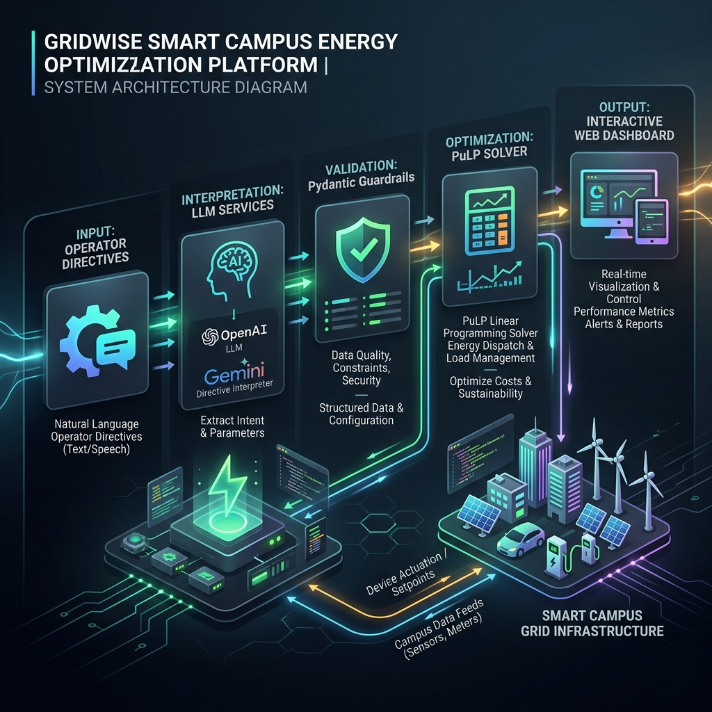

# ⚡ GridWise — Enterprise Smart Campus Energy Command Center & Optimization Engine
### 🏆 BUP CSE Fest 2026 Hackathon — Online Preliminary Challenge


---

## 🚀 Live Production Deployment

🔗 **Interactive Live Application**: [https://grid-wise-commander-system.vercel.app](https://grid-wise-commander-system.vercel.app)  
📖 **OpenAPI Interactive Documentation**: [https://grid-wise-commander-system.vercel.app/docs](https://grid-wise-commander-system.vercel.app/docs)  
💚 **Health Endpoint**: [https://grid-wise-commander-system.vercel.app/health](https://grid-wise-commander-system.vercel.app/health)

---

## 🏛️ System Architecture & Workflow



```
┌─────────────────────────┐       ┌─────────────────────────────────┐       ┌───────────────────────────────┐
│ Operator Directives     │  ───► │ LLM Structured Interpreter      │  ───► │ Pydantic Guardrail Engine     │
│ (Natural Language 1-3)  │       │ (OpenAI GPT-4o-mini / Gemini)   │       │ (Bounds, Ranges & No-Ops)     │
└─────────────────────────┘       └─────────────────────────────────┘       └───────────────────────────────┘
                                                                                            │
                                                                                            ▼
┌─────────────────────────┐       ┌─────────────────────────────────┐       ┌───────────────────────────────┐
│ Interactive Command UI  │  ◄─── │ Optimal 24h Hourly Dispatch     │  ◄─── │ Exact Linear Programming (LP) │
│ (Chart.js & Sliders)    │       │ (Cost BDT, SOC & Battery Action)│       │ Solver (PuLP / SciPy Fallback)│
└─────────────────────────┘       └─────────────────────────────────┘       └───────────────────────────────┘
```

---

## ✨ Key Enterprise Features

### 🧠 1. Multi-LLM Directive Interpreter & Guardrail System
* **Natural Language Parsing**: Translates operator directives (*"reduce solar by 30% between 1 PM and 4 PM"*, *"keep at least 150 kWh reserve from 5 PM to 10 PM"*) into structured machine-checkable JSON.
* **Supported LLMs**: Native support for **OpenAI GPT-4o-mini** and **Google Gemini 2.5 Flash** with zero-latency JSON schema response formatting.
* **Deterministic Guardrails**: Validates unique ascending hours `[0..23]`, normalizes time window bounds, enforces factor limits `[0.0..1.0]`, and filters distractor notes into `no_op`.
* **Offline Rule Parser Fallback**: Features an automated regex heuristic fallback engine ensuring 100% operation without API keys.

### 🧮 2. Mathematical Linear Programming (LP) Optimizer
* **Exact Global Optimization**: Solves the 24-hour campus dispatch schedule in **< 15 milliseconds** using **PuLP CBC / SciPy Simplex** solvers.
* **Feasibility Guarantee via Slack Variables**: Uses high-penalty slack variables to ensure the optimizer **never crashes or returns HTTP 500 errors**, even under extreme conflicting scenario constraints or impossible slider parameters.
* **Battery Storage System (BESS) Dynamics**: Models battery energy continuity $E_{h} = E_{h-1} + C_{h} - D_{h}$, maximum charge/discharge rates, minimum reserve bounds, and end-of-day battery neutrality ($E_{23} = E_{start}$).

### 🎛️ 3. Premium Interactive Command Center UI/UX
* **Live 24-Hour Parameter Modifier Sliders**: Interactively scrub through hours 0..23 to edit Demand (kWh), Solar (kWh), and Tariff (BDT) with auto-optimization toggle.
* **Visual Presets Selector**: Load pre-configured public evaluation sample cases (`SAMPLE-01` through `SAMPLE-10`) with a single click.
* **Quick Action Simulators**: Instant scenario toggling for ☀️ **Solar Boost (+50%)**, ⚡ **Grid Intake Cap**, 🔋 **Reserve Spike**, and 🔥 **Tariff Surge**.
* **Dual Chart.js Visualizations**: Interactive stacked generation vs load balance chart + Battery State of Charge (SOC) trajectory graph.
* **Financial Savings Badge**: Real-time comparison calculating BDT cost savings vs unoptimized baseline demand.

---

## 📡 API Specification & Schema Summary

### `POST /optimize-energy`
Primary endpoint accepting energy scenario and operator directives, returning structured directive interpretations and optimal 24-hour schedule.

#### Request Example:
```json
{
  "scenario_id": "GRID-SAMPLE-01",
  "operator_notes": [
    "From 1 PM to 3 PM, solar generation is reduced by 50% due to maintenance.",
    "Keep at least 100 kWh in the battery from 6 PM until 9 PM."
  ],
  "hours": [
    { "hour": 0, "demand_kwh": 120.0, "solar_kwh": 0.0, "tariff_bdt_per_kwh": 8.0 },
    ...
    { "hour": 23, "demand_kwh": 95.0, "solar_kwh": 0.0, "tariff_bdt_per_kwh": 8.0 }
  ],
  "battery": {
    "capacity_kwh": 500.0,
    "initial_energy_kwh": 200.0,
    "minimum_energy_kwh": 50.0,
    "max_charge_kwh_per_hour": 100.0,
    "max_discharge_kwh_per_hour": 100.0
  }
}
```

#### Response Example:
```json
{
  "scenario_id": "GRID-SAMPLE-01",
  "directive_interpretation": [
    {
      "note_index": 0,
      "applies": true,
      "directive_type": "solar_reduction",
      "structured_adjustment": { "hours": [13, 14], "factor": 0.5 },
      "explanation": "Solar generation reduced by 50% during hours 13:00 and 14:00."
    }
  ],
  "hourly_plan": [
    {
      "hour": 0,
      "grid_kwh": 120.0,
      "solar_used_kwh": 0.0,
      "battery_action": "idle",
      "battery_kwh": 0.0,
      "battery_energy_after_kwh": 200.0
    }
  ],
  "total_grid_kwh": 2450.0,
  "total_cost_bdt": 28400.0,
  "peak_grid_kwh": 160.0,
  "plan_summary": "Optimized 24-hour campus energy schedule. Applied 1 active operator directive(s). Achieved minimum grid cost of 28400.00 BDT."
}
```

---

## 🛠️ Local Installation & Development

```bash
# 1. Clone the repository
git clone https://github.com/foysalpranto121/BUP-_Hackathon-2026.git
cd BUP-_Hackathon-2026

# 2. Create and activate a Python virtual environment
python -m venv venv
# On Windows PowerShell:
.\venv\Scripts\Activate.ps1
# On Linux/macOS:
source venv/bin/activate

# 3. Install production dependencies
pip install -r requirements.txt

# 4. Configure environment variables
cp .env.example .env
```

Edit `.env` with your OpenAI or Gemini API credentials:
```env
OPENAI_API_KEY=your_openai_api_key_here
LLM_PROVIDER=openai
OPENAI_MODEL=gpt-4o-mini
HOST=0.0.0.0
PORT=8001
LOG_LEVEL=INFO
```

```bash
# 5. Start the local server
python main.py
```
Open **`http://localhost:8001`** in your browser.

---

## 🐳 Docker Container Deployment

```bash
# Build Docker image
docker build -t gridwise-commander .

# Run Docker container on port 8000
docker run -d -p 8000:8000 --env-file .env --name gridwise gridwise-commander
```

Or run via Docker Compose:
```bash
docker-compose up -d --build
```

---

## 🧪 Testing & Evaluation

Execute the automated test suite against all public evaluation sample cases:

```bash
python -m pytest tests/test_sample_cases.py -v
```

---

## 🔒 Security & Best Practices

- **Zero Secrets Leaked**: `.env` and sensitive credentials are git-ignored via `.gitignore` and `.vercelignore`.
- **Input Sanitization**: Pydantic models strictly enforce numerical ranges and array sizes.
- **Feasibility Safeguards**: Linear program relaxation prevents server crashes on extreme input parameters.

---

<p center align="center">
  <b>BUP CSE Fest 2026 Hackathon Preliminary</b> • GridWise Energy Command Center System
</p>
